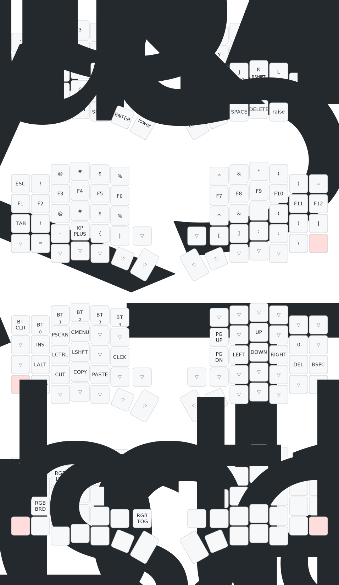

# Chú ý: Với các bạn đã Fork từ trước. Vào 2 mục sofle.conf và build.yaml copy paste vào repositories cũ của mình để mở chức năng zmk studio
# Thông tin mở rộng: các bạn có thể copy các dòng code rồi chat với chat GPT để hiệu chỉnh code đơn giản và paste lại xong commit, sẽ có nhiều phương án tối ưu dựa trên repos có sẵn, lưu ý rằng hãy nhồi nhét chức năng đủ dùng để hoạt động mượt mà với nhu cầu, đừng tham những chức năng không cần thiết, bàn phím sẽ đơ lag nếu những chức năng đó không hiệu quả

# Dưới đây là sơ đồ cơ bản chức năng phím

